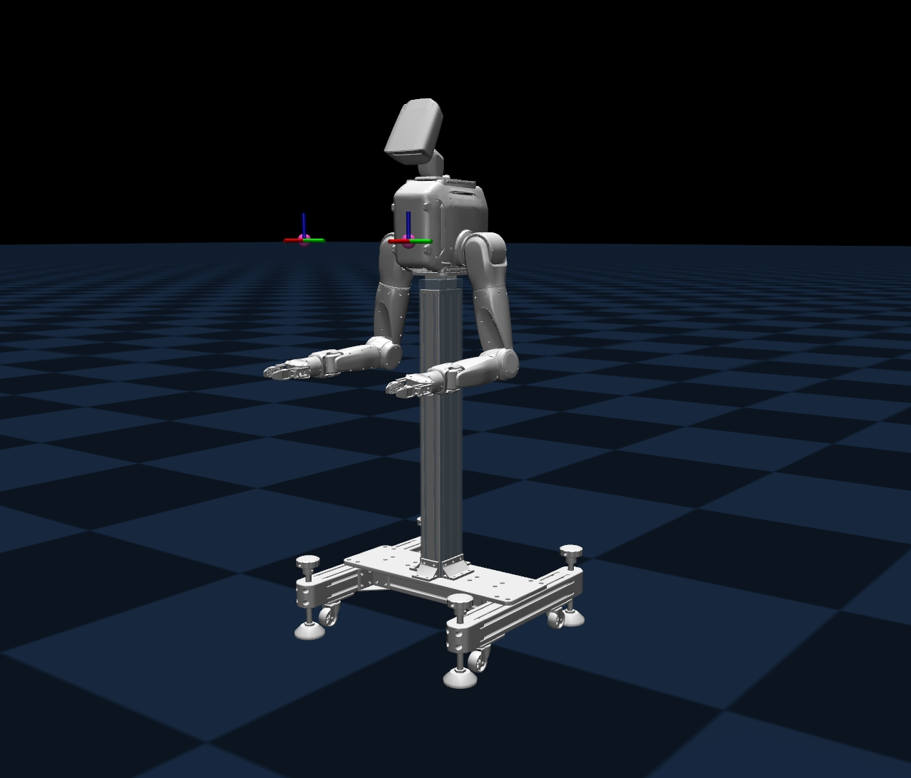

# DACH_SIM

[English](README.md)

<p align="center">
  
</p>

`DACH_SIM` 是面向 `DACH_TRON2A` 双臂机器人的本地仿真与 SDK 验证工作区，用于在本机通过 `127.0.0.1` 联调 MuJoCo 仿真器、双臂控制器、手柄遥控器和 WebSocket SDK。

完整用户操作流程见 [`USER_MANUAL.md`](USER_MANUAL.md)。

## 项目结构

```text
DACH_SIM/
├── USER_MANUAL.md             # 面向用户的完整使用手册
├── robot_description/         # TRON2 机器人模型 submodule
├── Tron2_simulation_mujoco/   # C++ MuJoCo 电机级仿真器
├── Tron2_controller/          # TRON2 双臂控制器运行包
├── joystick_sim/              # 手柄遥控器模拟器 / 无遥控器切模式脚本
└── Tron2_arm_tests/           # WebSocket SDK 测试套件
```

## 系统依赖

本仓库包含部分预编译运行包，`libmujoco210.so`、`libmroslib.so` 等动态库已随仓库提供；但下面这些运行时动态库通常不会在最小 Linux 系统中预装，需要由系统包管理器安装。以 Ubuntu 20.04 / Debian 系发行版为例：

```bash
sudo apt update
sudo apt install libglfw3 libglew2.1 libgl1 libwebsockets15 libssl1.1
```

- `Tron2_simulation_mujoco/tron2_mujoco_sim` 直接链接 `libglfw.so.3`、`libGLEW.so.2.1` 和 `libGL.so.1`。即使使用无窗口脚本 `run_headless.sh`，动态链接器也需要先找到这些库。
- `Tron2_controller/install/bin/signaling_node` 直接链接 `libwebsockets.so.15`。
- `libssl1.1` 不是本仓库中任何二进制的直接依赖，而是 `libwebsockets15` 包自身的传递依赖（其 control 段声明 `Depends: libssl1.1`），安装 `libwebsockets15` 时 apt 会自动带上。
- Ubuntu 22.04 及更新版本的默认仓库通常不再提供 `libssl1.1`。如果要直接运行当前预编译控制器，建议使用 Ubuntu 20.04 兼容环境，或提供满足 `libwebsockets.so.15` 加载要求的 OpenSSL 1.1 运行库（`libssl.so.1.1` / `libcrypto.so.1.1`）。

## 联调顺序

本地仿真建议使用四个终端，按下面顺序启动：

1. 设置机器人 SN：`source Tron2_controller/install/local_setup.bash` 后执行 `setRobotSN DACH_TRON2A_001`。未设置 SN 时不要启动控制器。
2. `Tron2_simulation_mujoco`：启动 C++ MuJoCo 仿真器，默认读取顶层 `robot_description` 模型并发布 `/motor/state`。
3. `Tron2_controller`：启动控制器，订阅 `/motor/state` 并发布 `/motor/cmd`。
4. `joystick_sim`：执行 `./pub.sh switch`，按默认 2 秒间隔依次发布 `idle`（`L1 + X`）和 `develop`（`R1 + Right`）。本工作区只提供模拟手柄指令，本机仿真链路不包含真实遥控器接入流程。
5. `Tron2_arm_tests`：运行 Move/Servo SDK 短时 live smoke 或专项仿真用例。

## 关键接口

```text
Tron2_arm_tests -> ws://127.0.0.1:5000 -> Tron2_controller
Tron2_controller -> /motor/cmd -> Tron2_simulation_mujoco
Tron2_simulation_mujoco -> /motor/state -> Tron2_controller
```

`Tron2_simulation_mujoco` 只处理底层电机状态和电机指令；MoveJ、MoveP、ServoJ、ServoP 等 SDK 接口由 `Tron2_controller` 通过 WebSocket 提供。

## 文档入口

- [`USER_MANUAL.md`](USER_MANUAL.md)：用户启动、切模式和 SDK 控制流程。
- [`Tron2_simulation_mujoco/README.md`](Tron2_simulation_mujoco/README.md)：C++ 仿真器环境与启动说明。
- [`robot_description/README_zh-CN.md`](robot_description/README_zh-CN.md)：机器人模型、URDF/xacro 和 mesh 说明。
- [`Tron2_controller/install/README_INSTALL_NEW.md`](Tron2_controller/install/README_INSTALL_NEW.md)：控制器运行包启动说明。
- [`joystick_sim/README.md`](joystick_sim/README.md)：模拟手柄切模式命令、别名和运行参数。
- [`Tron2_arm_tests/USAGE.md`](Tron2_arm_tests/USAGE.md)：SDK 测试参数、报告和专项用例说明。
- [`NOTICE`](NOTICE)：第三方库版权归因和 MROS/Fast DDS 修改声明。
- [`THIRD_PARTY_NOTICES.md`](THIRD_PARTY_NOTICES.md)：第三方库完整许可证文本。

## CI 与离线测试

仓库根目录提供 GitHub Actions 工作流 [`.github/workflows/ci.yml`](.github/workflows/ci.yml)，每次 push 或 pull request 会安装 SDK 测试所需的 Python 依赖并执行：

```bash
python3 -m pytest -q
```

该命令只运行不连接机器人、不启动仿真器的离线 pytest。`Tron2_arm_tests/scripts/run_all.sh` 及专项脚本属于 live 仿真联调，会连接本机 `127.0.0.1:5000` 并发送动作指令，不作为默认 CI 步骤执行。

## 注意事项

- 启动 `Tron2_controller` 前必须先执行 `setRobotSN DACH_TRON2A_001`，写入控制器运行包默认的 SN 配置位置。
- WebSocket 控制协议沿用官方 `tron2_env` 的明文 `ws://` 方式，不包含认证或 TLS；本开源工作区只保留本机回环仿真能力，目标地址应为 `127.0.0.1`。
- live SDK 会发送动作指令；本开源工作区不提供真机或现场内网连接配置。
- 本项目未实现软件急停。停止 SDK 进程、断开 WebSocket 或测试失败处理都不等同于急停，异常动作应依赖物理急停、遥控器或机器人侧安全机制处置。
- `Tron2_simulation_mujoco` 是 C++ MuJoCo 2.1 本机仿真运行包；机器人 XML 和 mesh 来自顶层 `robot_description`。
- `Tron2_controller` 是预编译运行包，不是完整源码工程。

## 许可证

除另有说明外，本项目基于 [`LICENSE`](LICENSE) 中的 Apache License 2.0 分发，SPDX 标识符为 `Apache-2.0`。预编译控制器运行包中所含第三方组件的版权归因见 [`NOTICE`](NOTICE) 与 [`THIRD_PARTY_NOTICES.md`](THIRD_PARTY_NOTICES.md)。
